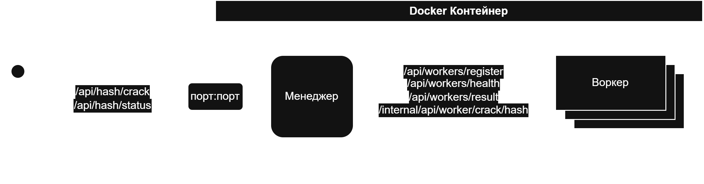

# CrackHash
## 1. Описание архитектуры
 Архитектура проекта состоит из двух приложений, [Manager](./Manager) и [Worker](./Worker).
 Первый отвечает за обработку запросов клиента, деоегирование задач воркерам и агрегирование результатов.
 Второй отвечает за исполнение делегированных задач.
 
 Проект написан на Kotlin с фреймворком Spring.

## 2. Схема взаимодействия компонентов
 
## 3. Инструкция по запуску
```cmd
docker-compose up -d --scale worker=3
```
## 4. API и примеры запросов
> POST http://manager/api/hash/crack

Ручка для клиента, применяется для создания основной задачи по взлому хэша.
```json
{
 "hash": "5f4dcc3b5aa765d61d8327deb882cf99",
 "maxLength": 4
}
```
> GET http://manager/api/hash/status?requestId=...

Ручка для клиента, по заданному uuid позволяет посмотреть статус выполнения задачи. 
> POST http://manager/api/workers/register

Ручка для воркера, приходя на этот эндпоинт конкретный воркер может зарегистрироваться, получить себе uuid и приступить к ожиданию задач от менеджера.
```json
{
 "status": true
}
```
> POST http://manager/api/workers/health

Ручка для воркера, сюда следует посылать пинги для уведомления менеджера о своей работопригодности. Если этого не делать, спустя ${HEARTBEAT_CHECK_INTERVAL} менеджер посчитает воркера мёртвым, после чего перераспределит делегированные ему задачи.
```json
{
 "id": "21391c47-9466-4832-92e2-682a48088de6"
}
```
> http://manager/api/workers/result

Ручка для воркера, сюда он шлёт результат своих вычислений.
```json
{
 "workerId": "21391c47-9466-4832-92e2-682a48088de6",
 "requestId": "ef240b8f-623a-418b-a7b8-5eb6658037cc",
 "result": ["abcd"]
}
```
> http://worker/internal/api/worker/crack/hash

Ручка для менеджера, сюда он отсылает конкретному воркеру задачу в следующем формате:
```json
{
 "subTaskId": "a96842f1-e7e8-43ae-8061-fcada68003c6",
 "requestId": "ef240b8f-623a-418b-a7b8-5eb6658037cc",
 "hash": "5f4dcc3b5aa765d61d8327deb882cf99",
 "maxLength": 4,
 "alphabet": "0123456789abcdefghijklmnopqrstuvwxyz",
 "partStart": 0,
 "partEnd": 1000
}
```
## 5. Используемые конфигурационные параметры.

>MANAGER_PORT=8080

Порт, на котором менеджер слушает воркеров
>HASH_ALPHABET=0123456789abcdefjhijklmnopqrstuvwxyz

Алфавит для поиска слова
>USER_STATUS_ENDPOINT=/api/hash/status
>USER_REQUEST_ENDPOINT=/api/hash/crack
>WORKER_REGISTRATION_ENDPOINT=/api/workers/register
>WORKER_HEARTBEAT_ENDPOINT=/api/workers/health
>WORKER_RESULT_ENDPOINT=/api/workers/result
>WORKER_INTERNAL_ENDPOINT=/internal/api/worker/crack/hash

Эндпоинты в приложении

>HEARTBEAT_CHECK_INTERVAL=30000

>HEARTBEAT_SEND_INTERVAL=15000

Значения для health чеков